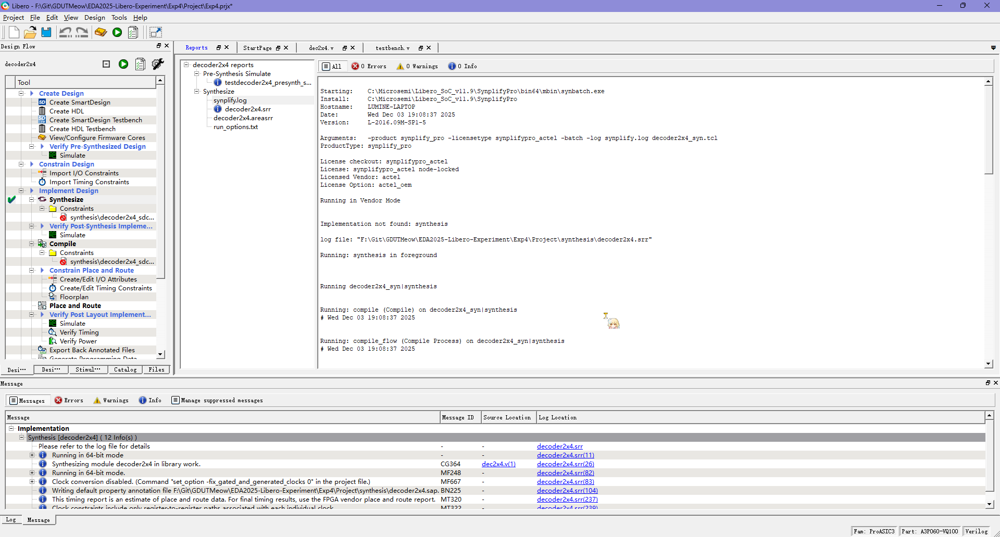
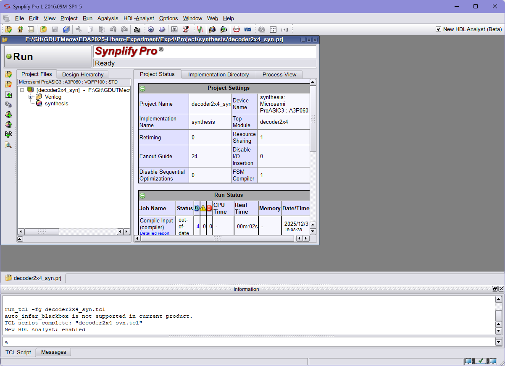
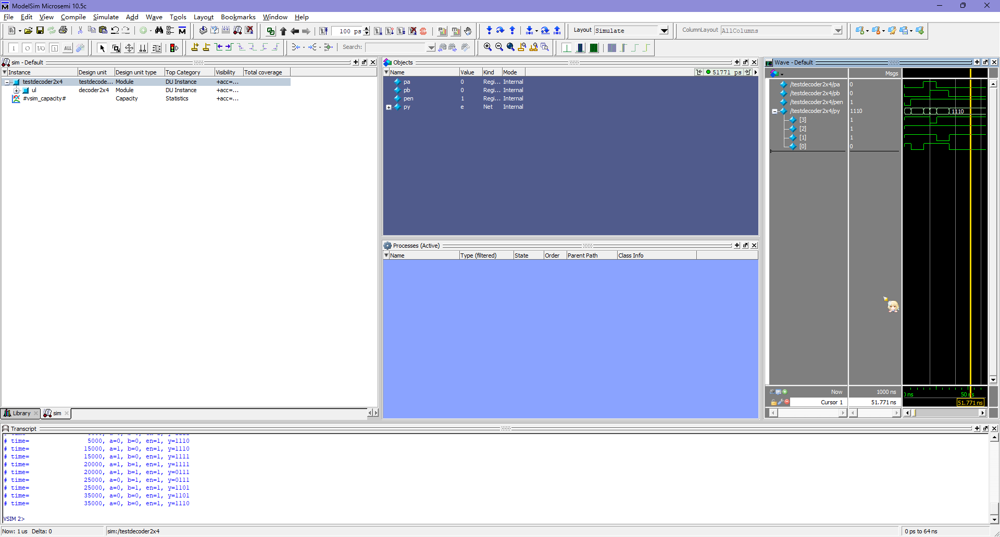
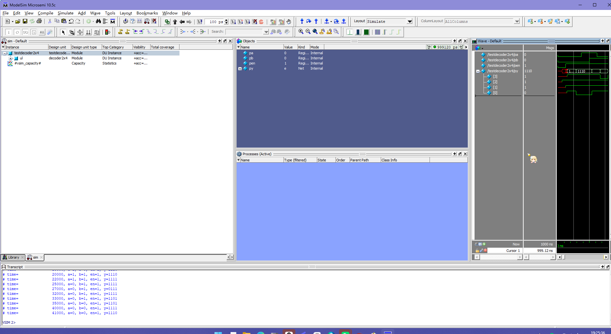
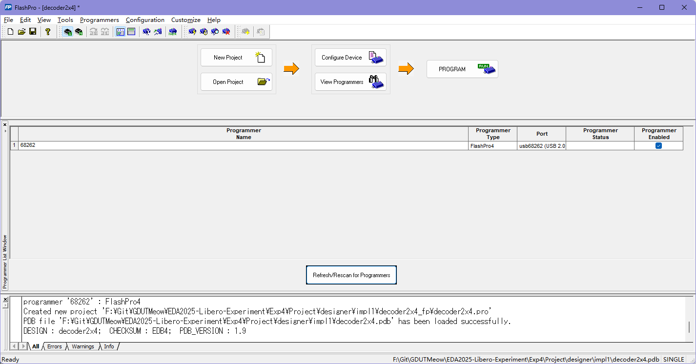
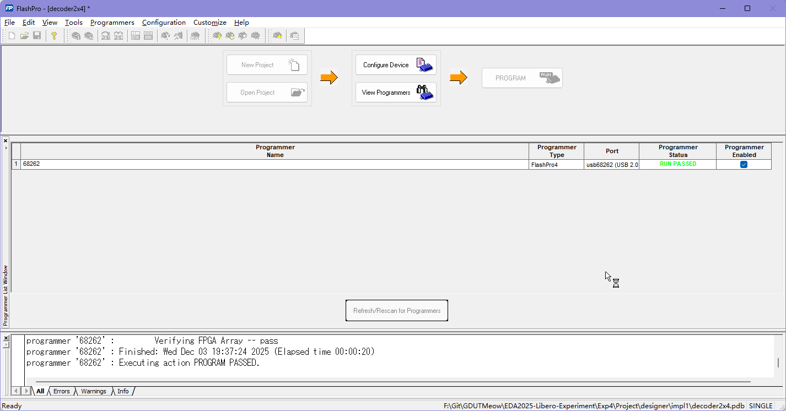

模拟运行结果如图

综合结果如图

打开 Synplify Pro 如图所示

点击工具栏的<kbd>+</kbd>按钮后，生成的逻辑电路图如图所示

点击<kbd>🔌</kbd>按钮后，生成的工艺图如图所示

综合后，重新模拟的情况如图所示

经过自动布线及生成 Programming File 后，Designer 全绿

在 Designer 点击保存后，Design Flow 中有对应的对勾

封装后再一次模拟，结果如图所示

打开 Flash Pro，正确显示设备

加载 configuration 后，RUN 变成 PROGRAM

点击 PROGRAM 按钮，执行烧录操作

过一会烧录完成

